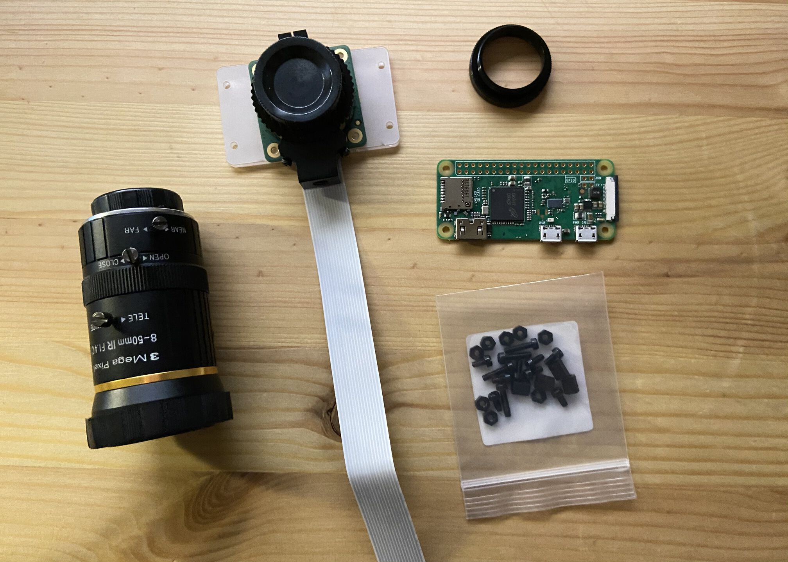

# rpi-timelapse
Barebone, less than 100 LOCs timelapse CLI for Raspberry Pi.
All batteries included, no additional python package required.

Now that we've got the High Quality Camera with interchangeable lenses.. who wouldn't want to spend some time doing timelapses?

